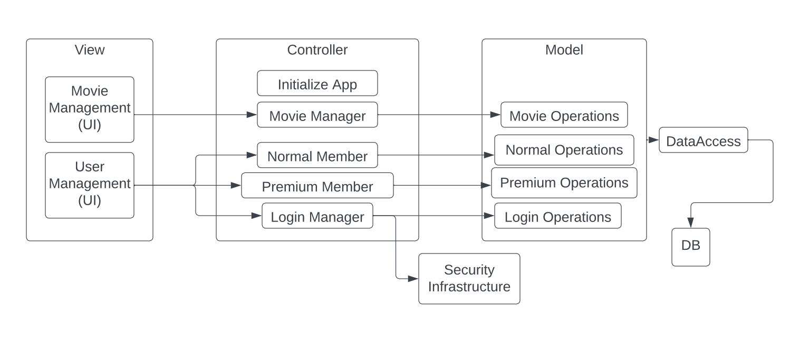

# Design Document

## Movie Ratings
--------
Prepared by:

* `Trevor Buchanan`,` Team Quartet`
* `Matei Vitalaru Moruz`,` Team Quartet`
* `Brian`,` Team Quartet`
---

**Course** : CptS 322 - Software Engineering Principles I

**Instructor**: Sakire Arslan Ay

---

## Table of Contents
- [Design Document](#design-document)
  - [Movie Ratings](#movie-ratings)
  - [Table of Contents](#table-of-contents)
    - [Document Revision History](#document-revision-history)
- [1. Introduction](#1-introduction)
- [2.	Architectural and Component-level Design](#2architectural-and-component-level-design)
  - [2.1 System Structure](#21-system-structure)
  - [2.2 Subsystem Design](#22-subsystem-design)
    - [2.2.1 Model](#221-model)
    - [2.2.2 Controller](#222-controller)
    - [2.2.3 View and User Interface Design](#223-view-and-user-interface-design)
- [3. Progress Report](#3-progress-report)
- [4. Testing Plan](#4-testing-plan)
- [5. References](#5-references)

### Document Revision History

| Name | Date | Changes | Version |
| ------ | ------ | --------- | --------- |
|Revision 1 |2021-10-05 |Initial draft | 1.0        |
|Revision 2 |2023-10-21 |Set up        | 1.1        |
|Revision 3 |2023-10-23 |Completion of Design Document(iteration1)   |1.2         |

# 1. Introduction

This design document is in place to show the progress from iteration 1 and how we implemented a base skeleton code to build off in our future iterations. In iteration 1 we created our index template and made working links for all aspects of our project which we defined in the Requirements Document. We implemented registration features, login/logout features, and made review posting possible. With the overall project, we now plan to work our way into having the following by the end. A regular member and premium member system which both have different levels of access to the site, personalized profile settings for all users which includes implementing a friends list for premium users. We plan also to have a system where when clicking on a movie review, you will be redirected to all reviews for the movie. Along with these objectives, this document outline will explain the design goals and processes of the project at hand. 

Section 2 includes the design process and aspects of the sections of our code labeled controller, model, and user Interface (html)

Section 3 describes the progress we made as a team in iteration 1

Section 4 describes the plan we have towards testing our functions and routes, and we will implement them

Section 5 is a section dedicated to outside references used in this project

# 2.	Architectural and Component-level Design
## 2.1 System Structure

The client-server architectural pattern used in this project is Model-View-Controller (MVC). This allows for rapid development and progress. It also allows for the project to be more easily debugged. Below is a UML component diagram illustrating the major subsystems and how they fit together.

* UML component diagram:

  * In the view part of the model, there is a manager for the movies and for the user. The views are told how to be displayed on the screen here
  * In the next level of MVC, the Controller initializes the app, and manages what happens to the models, and tells the viewers what to show.
  * In the deepest level of MVC, the Model runs the logic for the system. In the diagram shown above, the operations for movies, normal and premium users, and login are computed as needed.

* Model-View-Controller promotes reusability and allows for the project to be easily updated. This architecture also provides separation between the layers of the program. This reduces unwanted coupling between the project parts.

## 2.2 Subsystem Design 

### 2.2.1 Model

**Review:** This model contains all the aspects of a review that a user is able to edit and submit to the site, the sections include an id number, title of the movie, review textbox, rating 1-100, a timestamp of when the review was posted, and a member_id for future use when members will be able to view all their personal reviews.

**Member:** This model contains all the specifications of a regular member (premium member will be implemented in iteration2). These members will have an id, username, email, and a password afte rregistration and will be able to log in and out.

No relationships have been established in iteration 1.

### 2.2.2 Controller

|   | Methods           | URL Path   | Description  |
|:--|:------------------|:-----------|:-------------|
|1. |   'GET'                |   '/index'         | The index is the home page of the site where all reviews will be accessed. Users will be able to view reviews as well as click on movie titles to view all reviews for the movie itself. Users will also be able to filter results on the index page by certain review aspects (tbd). The index will often be used as a redirect (render_template) page for other routes.             |
|2. |   'GET' 'POST'                |  '/postReview'          |  The postreview page is accesed through the index page, when directed to the page, users (if logged in) will be able to poast a movie review and submit to the database. Once a review has been posted, the user will be redirected to the index page where they can see previous reviews, as well as the newly made one on the page.            |
|3. |  'GET' 'POST'                 |   '/friends'         | The friends page is something that will be implemented in later iterations, but the goal of the friends page will be to display a friends list to users of premium status (yet to implement as well). In the friends page, users will be able to also submit friend requests in order to populate their friends list.             |
|4. |   'GET' 'POST'                |   '/profile'         | Also yet to be implemented, the idea of the profile page is to allow users to view their profile when clicking the link "profile". The profile page will include all personal movie reviews as well as wish list movies specified to the user themselves. The user will be able to edit wishlist movies and personal reviews from the profile page and save it to the database before wishing to go to other parts of the site.             |
|5. |   'GET' 'POST'                |  '/register'          | The register route is an auth route, meaning its specification lies in allowing users access to different parts of the site. Before registering, users will not be able to submit reviews or view profile aspects. When signing in, the user will be prompted to register if they do not have a login, from there, the user will register an account with a valid username, email, and password. Once submitting the registration, the user will be redirected to the login page.             |
|6. |   'GET' 'POST'                |  '/login'          |  The login page is another auth route where users will be able to access the page only if not logged in via the heading bar atthe top of the site. The login page is similar to registration (as the link to register is in the login page itself) but will actually log a user in when a valid username and password have been submitted in the prompted boxes. Logged in users have access to Profile, making reviews, and premium logged in users will have access to Friends list. Once logged in, users will be redirected to the index page.            |
|7. |   'GET' 'POST'                |   '/logout'         | Logout is another auth route whcih will log the user out and will only be visible to currently logged in users. Once logged out, users will be redirected to the login page.  

### 2.2.3 View and User Interface Design 

**main.css:** Our main.css procides all the formats we will use in our site, making the site not only have a clean look, but be more user friendly with the button and page formatting.

**index.html:** This template will be the home page where users can access all aspects of the site including reviews, login/register/logout features, profile, and friends. Many routes will redirect backto the index page

**login.html:** When a user decides to login, they will be directed to the page formatted by the login.html template. This template prompts a username and password, which will display red error messages when invalid information is submitted. In addition, this template contains a redirect for new users to go to the resister page.

**register.html:** Once a user selects to register from the login page, they will be directed to this template. The template includes prompts asking for a valid username, email, and password. Red error messages will flash if invalid information is submitted. Once a user submits valid information, the template will direct the user back to the login template.

**profile.html:** This template will be implemented in iteration 2, but has been created as a blank page on the site as of iteration 1. Pressing "Profile" button on the top bar will direct you to this template.

**create.html:** When selecting "Post Review" in the index page, users will be directed to this template. The "create" template is fully styled and has prompts for a movie title, review, and 1-100 rating. Once submitted, users will be directed back to the index page to view their new review

**_post.html:** This template is a crucial part of index.html, as _post.html includes the information inside of all reviews, which when iterated through with a for loop, displays all movie reviews in the indx page.

**friends.html:** Also yet to be implemented in future iterations, when selecting "Friends" users of premium status will be able to view friends lists and submit friend requests.

**base.html:** Arguably the most important template of the site, base.html allows users to navigate the site (login, reviews, friends, profile, etc.). base.html contains multiple redirects for such options and is always present at the top of the page of the site itself. base.html also allows the site to flash success messages to the user when actions are performed (at the top).

A library/framework we plan on using may be **Bootstrap**. Bootstrap will allow us to create a very well put together site while also simplifying future forms/models issues when implementing premium members in comparison to regular members 

# 3. Progress Report

Iteration 1 was meant to provide the skeleton for the application. The home page('index') was added as the center for all movie posts. The ability to log in and register for a single user was also added. Two empty pages, ‘profile’, and ‘friends’, were added in order to lay out the framework for future iterations. Lastly, the page 'Add Move' was added to provide the capability to add movies to the database. Each movie has a required rating field, that is shown with the title on the index page.

# 4. Testing Plan

In this project, the Unit Tests for Movie Ratings are under the tests folder. The first file, 'test_models.py', tests all of the models in this project. These include the review member user and premium user tests. The second file test_routes, tests all routes, including login, logout, register, postReview, and index. The last test file, test selenium, tests the register form, the login form, and post review.

  * *Unit Testing*: 
    * test_password_hashing() - Tests the security (hashing) of passwords and how they work with accounts
    * test_review_1() - Tests creating a review
    * test_review_2() - Tests creating a review
    * test_register_page() - Tests route and destination to register page
    * test_register() - Tests registering a new user
    * test_invalidlogin() - Tests if program rejects an invalid username or password
    * test_login_logout() - Tests if user can successfully log out
    * test_postReview() - Tests posting a review
    * test_register_form() - Tests registering user from register form
    * test_register_error() - Tests if program rejects invalid register information
    * test_login_form() - Tests logging in user from login form
    * test_invalidlogin() - Tests logging in with incorrect login credentials
    * test_post_review() - Tests posting a review
    * post_review2() - Tests posting a review
    * test_post_review_error() - Tests posting an invalid review

  * *Functional Testing*: For functional testing, use cases can be verified through the given unit tests. 

  * *UI Testing*: To test the user interface, manual checks can be made. The project should satisfy the requirements given in the project requirements document.

# 5. References

----
